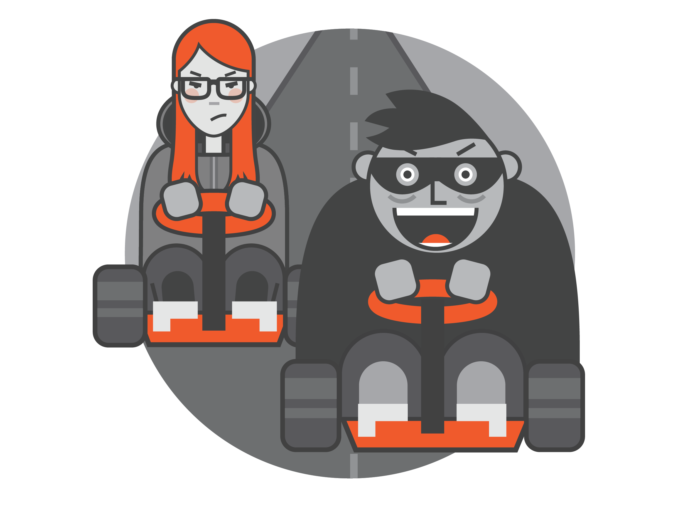

In the m0leCon CTF 2023, I participated with team TCP1P and successfully solved several web challenges.

In this article, I will provide a write-up about an intriguing challenge named "goldinospizza2." This particular challenge revolves around exploiting a vulnerability known as a "Race Condition." By taking advantage of this vulnerability, participants have the opportunity to accumulate significant wealth within the context of the challenge.

# What is Race Condition?



In this challenge, we will be exploiting a vulnerability called a Race Condition. A Race Condition occurs when multiple processes or threads attempt to access and modify a shared resource simultaneously. It's like a race where different processes compete to access the same thing at the exact moment, leading to unpredictable behavior within the system.


For example, in the image above, we have Thread A and Thread B both accessing a shared value of 17 in a database. If we introduce a process that adds 1 to the value near the time when Thread B accesses it, we can end up with two separate processes fetching the value of 17 from the database. As a result, the value will only increment by one instead of two.

In this challenge, we can exploit the Race Condition vulnerability to achieve an unintended outcome. Specifically, we can manipulate the website to give us more money by purchasing a pizza before another process completes its execution. This manipulation causes the system to count the purchase multiple times, resulting in a greater benefit when it comes to refunding. Consequently, we end up with more pizzas to refund without having to add more money to our account.


To exploit this vulnerability, we need to send a request to buy a pizza simultaneously with the intention of generating more pizzas to refund. This action manipulates the concurrent execution of the two processes involved in the money calculation. One process handles the pizza purchase, while the other manages the deletion of a pizza and the subsequent refunding of our money.

By carefully orchestrating our actions and timing the requests, we can take advantage of the Race Condition and exploit the flaw in the system. As a result, we can gain an unlimited amount of money by generating additional pizzas to refund without actually spending more money. In essence, we are leveraging the concurrent execution of the system to our benefit and bypassing the normal limitations to accumulate wealth.

# Exploiting Our Online Pizza Delivery Service

Now that we understand what a Race Condition is and how it can affect a program, we will attempt to exploit the "goldinospizza2" challenge to make a profit. By exploiting the Race Condition vulnerability, we aim to purchase the golden pizza, which will ultimately provide us with the flag, indicating successful completion of the challenge.

## Challenge Description

What's for lunch? Free 🍕 is for lunch!
(Note: archive password is the sha256 of the flag of goldinospizza

```shell
7z x -p"$(echo -n "ptm{goldinospizza's flag}" | sha256sum | cut -d ' ' -f 1)" goldinospizza2.zip)
```

Author: @0000matteo0000

## Exploit

In this challenge, we are provided with the source code, which can be found at the following link:

<https://drive.google.com/file/d/117CnMwdK5QLcqrKOliaGndSccun09Me8/view?usp=sharing>

The challenge involves exploiting a server, but since the challenge is currently unavailable, we will be using the localhost instead.

When accessing the provided URL, we will encounter a login page, as shown in the image below:


On this page, we are presented with the option to either register as a new user or log in using existing credentials. To proceed, we will need to register and then log in as a user.


After successfully registering as a user, we will be redirected to the home page where we will see our current balance of 30 euros, which we can use to buy a pizza. The goal of the challenge is to purchase the **GOLDEN Pizza** and obtain the flag. However, since we only have 30 euros, we need to exploit the Race Condition vulnerability in order to acquire more money and afford the golden pizza.

To exploit the Race Condition vulnerability in this challenge, we need to understand that it uses the WebSocket protocol to interact with the client. By examining the provided source code, we can gain insight into how the WebSocket is used and how we can manipulate it to exploit the vulnerability.


In the provided source code, we can observe several functions being used, such as balance, order, cancel, and orders.


Among these functions, the order and cancel functions are particularly interesting.

In the `order` function, as depicted below, we can observe that it reduces our balance by the product of the pizza price and the quantity of pizzas being ordered. Subsequently, it stores the updated balance in the database session.


In the `cancel` function, as illustrated below, we can observe that it increases our balance (refunds) by the product of the pizza price and the quantity of pizzas being canceled. It then stores the updated balance in the database session.


Two of these functions are the key functions that we will exploit to gain unlimited wealth. But how can we achieve that? We will utilize the Race Condition vulnerability in the WebSocket communication and repeatedly call the order function.

By making multiple concurrent requests to the order function, we create a situation where multiple processes can potentially access and modify the shared resource (our balance) simultaneously. This race condition can lead to a doubling of the Order, meaning that our money will only be reduced by the cost of one order, while the system will store and acknowledge the existence of two orders.

As a result, we can later exploit this situation by requesting a refund for both of these orders, effectively doubling our money. By carefully orchestrating and timing these requests, we can exploit the Race Condition to continually increase our wealth without actually spending more money.

To exploit the Race Condition vulnerability using the provided script, you can execute the following JavaScript code in the client-side or developer console:

```javascript
var ws = new WebSocket(`wss://${document.domain}:${location.port}/sock`);
function sendMessage(sender, message) {
    ws.send(JSON.stringify(message));
}
ws.addEventListener("open", () => {
    for (var i = 0; i < 100; i++) {
        sendMessage("", {
            "request": "order",
            "orders": [{
                "product": 1,
                "quantity": 1,
            }],
        });
    }
});

```

This script establishes a WebSocket connection to the server and sends multiple concurrent requests to the `order` function. In this case, we are making 100 requests simultaneously, triggering the Race Condition and potentially leading to the creation of duplicate orders.


By executing this script, you exploit the vulnerability and increase your chances of receiving double or more orders, which can later be refunded to gain more money.

Before executing the exploit, the initial balance is displayed as:


After executing the exploit, you need to refresh the page to see the updated balance. The balance after the exploit is shown as:


As you can see, we now have more money available for refund than we initially spent.


When you click the cancel or refund button, and observe that your money increases by double the amount, it indicates that you have successfully exploited the Race Condition vulnerability. This means you can repeat this process several times to accumulate enough money to buy a GOLDEN Pizza and obtain the flag.

:::info
To speed up the process, you can try increasing the quantity of the order.
:::

Now that you have accumulated enough money, you can proceed to buy the GOLDEN Pizza. Place the order, and you will receive the flag.


## How to Avoid Race Conditions?

To avoid race conditions in your code, you can follow some recommended practices and synchronization mechanisms:

*   **Synchronization Mechanisms**: Implement synchronization mechanisms to coordinate access to shared resources. One commonly used mechanism is using locks or mutexes to ensure that only one thread or process can access a shared resource at a time. You can refer to this article for more information: [Python Threading Lock](https://www.pythontutorial.net/python-concurrency/python-threading-lock/).

*   **Atomic Operations**: Utilize atomic operations or atomic data types provided by your programming language or framework. Atomic operations guarantee that certain operations are executed as a single, indivisible unit, preventing interleaved access to shared resources.

*   **Thread Safety**: Design your code and data structures to be thread-safe. This involves ensuring that concurrent access to shared resources does not lead to incorrect or inconsistent behavior. Techniques such as thread-local storage, using immutable data, or employing proper locking mechanisms can help achieve thread safety.

*   **Avoid Shared Mutable State**: Minimize the use of shared mutable state whenever possible. Immutable data structures or message passing between processes can reduce the likelihood of race conditions. By avoiding shared mutable state, you eliminate the need for synchronization and reduce the chances of concurrent access conflicts.

*   **Proper Resource Management**: Ensure that resources are acquired, used, and released correctly. This applies to file handles, database connections, and any other shared resources. Use appropriate locking or synchronization mechanisms to prevent race conditions during resource access.

By following these practices and applying suitable synchronization techniques, you can minimize the risk of race conditions in your code and ensure correct and reliable concurrent execution.

## Summary

Race conditions are a significant vulnerability that can have serious consequences for companies. In this article, we explored how race conditions can be exploited to gain unauthorized advantages, such as obtaining more money than intended.

To prevent race conditions, programmers should implement synchronization techniques, use atomic operations, ensure thread safety, minimize shared mutable state, and manage resources properly. By addressing these issues, we can mitigate the risks associated with race conditions and protect systems from potential exploits.

It is crucial for programmers, especially those working in large companies handling sensitive data or financial transactions, to be aware of the dangers posed by race conditions and prioritize their prevention. By doing so, we can ensure the integrity and security of our systems and avoid the potential consequences of race condition vulnerabilities.

## Reference

*   <https://book.hacktricks.xyz/pentesting-web/race-condition>

*   <https://www.youtube.com/watch?v=MqnpIwN7dz0>

*   <https://medium.com/wearesinch/exploiting-and-fixing-a-race-condition-problem-12976baa952c>

*   <https://stackoverflow.com/questions/38757923/how-to-fix-fortify-race-condition-singleton-member-field-issue>

*   <https://www.pythontutorial.net/python-concurrency/python-threading-lock/>
